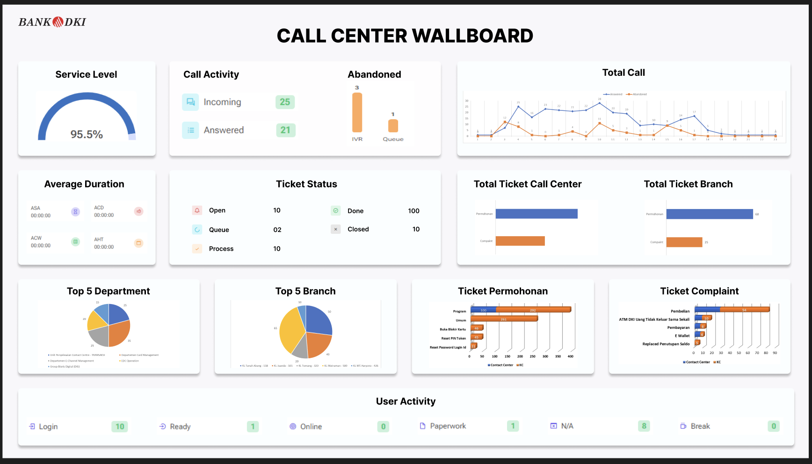

# Call Center Wallboard Dashboard

A real-time dashboard for monitoring call center metrics and analytics.



## Features

- Real-time monitoring of call center metrics
- Service level and call activity tracking
- Abandoned call analysis
- Call duration metrics (ASA, ACD, ACW, AHT)
- Ticket status and distribution visualization
- Top departments and branches analysis
- Ticket categorization (permohonan and complaint)
- User activity monitoring

## Tech Stack

- **Framework**: Next.js (App Router)
- **Styling**: Tailwind CSS
- **Client-side data fetching**: SWR
- **Database**: MySQL
- **DB Client**: mysql2 (Node.js)
- **Charts**: Highcharts and HighchartsReact

## Project Structure

```
src/
├── app/
│   ├── api/                  # API routes
│   │   ├── calls/            # Call-related endpoints
│   │   ├── tickets/          # Ticket-related endpoints
│   │   └── users/            # User-related endpoints
│   ├── dashboard/            # Dashboard page and components
│   │   └── components/       # Dashboard UI components
│   ├── globals.css           # Global styles
│   ├── layout.tsx            # Root layout
│   └── page.tsx              # Home page
└── lib/                      # Utility functions
    ├── db.js                 # Database connection utility
    └── swr.js                # SWR configuration
```

## Getting Started

### Prerequisites

- Node.js 18.x or higher
- MySQL database

### Installation

1. Clone the repository:
   ```bash
   git clone https://github.com/your-username/wallboard-dki.git
   cd wallboard-dki
   ```

2. Install dependencies:
   ```bash
   npm install
   ```

3. Create a `.env.local` file in the root directory with the following variables:
   ```
   DB_HOST=192.168.3.5
   DB_USER=rootdev
   DB_PASSWORD=-productD3v3l0pm3nt-
   DB_NAME=synergix_bdki
   ```

4. Run the development server:
   ```bash
   npm run dev
   ```

5. Open [http://localhost:3000/dashboard](http://localhost:3000/dashboard) in your browser to see the dashboard.

## Database Schema

The application expects the following tables in the database:

- `call_logs`: Contains call center activity data
- `tickets`: Contains ticket information
- `user_activity`: Contains user status information

## Deployment

To build the application for production:

```bash
npm run build
npm start
```

## License

This project is proprietary and confidential.
